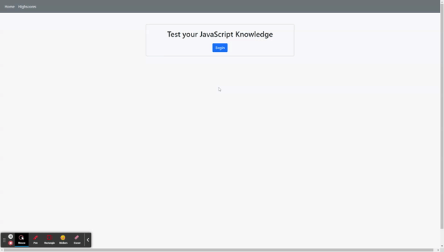

# Code-Quiz

This is [a JavaScript Quiz](https://luketeal.github.io/Code-Quiz/).  

The project uses HTML, CSS, and JS as a codebase largely pulling froom Bootstrap for styling.

## Repository Contents
The repository includes

* Two HTML files:
    * One for the [Home page](./index.html) and;
    * One for the [Highscores](./highscore.html) page;
* The [CSS](./assets/css) code; 
* Two JavaScript files:
    * One for the [Home Page](./assets/js/script.js); and
    * One for the [Highscores](./assets/js/scripthighscore.js) page;
* [GIF](./assets/images) of intended functionality.

## Objectives

The web app presents the user with a series of questions about JavaScript, evaluates the answers and calculates and saves the users scores into a highscores list.  

## Instructions

1. Select "Begin" from the home page
    * A timer will begin presenting the user with time left in the quiz
2. Answer the questions presented
    * Incorrect answers deduct 10 seconds from the timer
3. The quiz ends when the timer reaches zero or all the questions are answered
    * Any unanswered questions are considered incorrect.
4. The user may save their score locally by typing in their initials when presented with their score and selecting "Submit"
5. On the Highscores screen the user may clear the scores from their local storage
6. The user may navigate between the home page and highscores page at any time from the links in the header.

## Screenshot
The image below show's the web app's appearance and functionality:

.

## Credits
* The HTML is styled primarily using Bootstrap v5.0.0-beta3
* Normalize v8.0.1.css downloaded from Nicolas Gallagher's github page